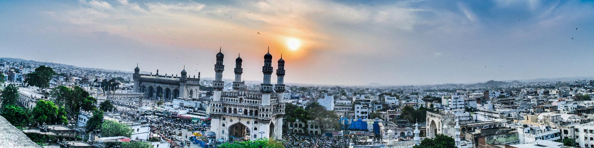

This workshop at [India HCI 2020](https://www.indiahci.org/2020/) invites academic researchers, designers and practitioners from industry with a keen interest in designing visualisation for emergent users of ICTs.

The key purpose is to have an informal and interactive discussion about each candidates’ ongoing research, with the intention to sharpen it. We are looking for a diverse group of people who are interested in presenting their work/research at the workshop during the conference. This workshop aims to provide useful guidance for completion of the research and the initiation of a research career in a friendly and constructive atmosphere.

The workshop has the following objectives:
- The workshop shall provide a joint forum for participants coming from different, mostly disconnected research backgrounds.
- The participants shall learn about the latest developments in their own as well as adjacent HCI research areas.
- The workshop shall foster interaction among the participants and establish collaborations between the researchers for future research work.
- After the workshop, provide a set of publicly available key readings for thinking about discussed questions and a set of position papers, updated based on the workshop, that explains participants’ thinking about these questions.

    

India HCI '20 will take place online from November 6 - 8 (Tue - Thur), 2020.

  

# Organisers
- [Amit Jena](https://amitjenaiitbm.github.io/amitjena/) (IITB-Monash Research Academy - Mumbai, India)
  - Email: amit.jena@monash.edu
- [Shimmila Bhowmick](http://embeddedinteractions.com/people.html) (Indian Institute of Technology – Guwahati, India)
  - Email: shimmila.bhowmick@gmail.com

# Call for applications

*Our call for applications is now [closed](call.md)!*

# Participants

    

(From left to right)  
Nikhil Prakash (R.V. College of Engineering, Bangalore, India)  
Pranjal Protim Borah (EI LAB, IIT Guwahati, India)  
Amit Jena (IITB-Monash Research Academy, Mumbai, India)  
Vidya Sarangapani (Open Lab, England)  
Chandni Murmu (Gramener, Hyderabad, India)  
Asad Ali Junaid (Adobe Inc., Bengaluru, India)  
Nishita Nirmal (IDC School of Design, IIT Bombay, Mumbai, India)  
Ankita Diwan (Shipsy, Gurgaon, India)  
Nagraj Emmadi (Wipro Limited, Hyderabad, India)  

# Program

<table>
<tr>
	<th colspan="2">Friday November 1</th>
</tr>
<tr>
	<td width="50">11:00</td><td width="500">Intro & overview</td>
</tr>
<tr>
	<td>11:15</td><td>Presentation by Amit Jena</td>
</tr>
<tr>
	<td>11:45</td><td>Presentation by Pranjal Pratim Borah</td>
</tr>
<tr>
	<td>12:15</td><td>Lunch</td>
</tr>
<tr>
	<td>15:00</td><td>Presentation by Vidya Sarangapani</td>
</tr>
<tr>
	<td>15:30</td><td>Open discussion on Ph.D. research</td>
</tr>
</table>
