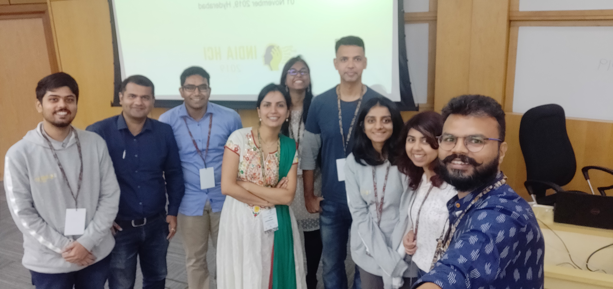

This workshop at [India HCI 2020](https://www.indiahci.org/2020/) invites academic researchers, designers and practitioners from industry with a keen interest in designing visualisation for emergent users of ICTs.

Visualising data is effective when done right. When people can interpret the visualisation by asking more questions on the information displayed versus how or what is displayed, then we know the visualisation is done right. So to be effective, it is essential to design the right visualisations for the data to allow users to interpret and make decisions based on what they observe.

But data visualisation design is built upon the studies of a highly educated subset of the populations who have easy access to and extended familiarity with Information and communications technologies (ICTs). Lately, the population with access to the internet and mobile technologies have reached a significant number. The workshop will start the conversation on how to design visualisations for the Emergent Users of ICTs, with the objective of understanding the intricacies for such design. The participants will be introduced to the various types of visualisations that we commonly see in our daily life, discuss the pros and cons of each, and try to understand how the Emergent Users of ICTs will interpret these visualisations. From the workshop, we aim to draw design guidelines, open questions and hypothesis that will need further study.

# Organisers
- [Amit Jena](https://amitjenaiitbm.github.io/amitjena/) (IITB-Monash Research Academy - Mumbai, India)
  - Email: amit.jena@monash.edu
- [Seema Krishnakumar](https://iith.ac.in/des/seema/) (Indian Institute of Technology – Hyderabad, India)
  - Email: seema@des.iith.ac.in
- [Venkatesh Rajamanickam](https://info-design-lab.github.io/) (Indian Institute of Technology – Bombay, India)
  - Email: venkatra@iitb.ac.in

# Call for participation

*Coming Soon*

<!-- # Participants

    

 -->

# Program

<table>
<tr>
	<th colspan="3">Thursday November 5</th>
</tr>
<tr>
	<td>09:15</td><td>Introduction and </td><td>The Session will introduce the participants and their experience in the field of Visualisation Design.</td>
</tr>
<tr>
	<td>09:15</td><td>Introduction and </td><td>The Session will introduce the participants and their experience in the field of Visualisation Design.</td>
</tr>
</table>
